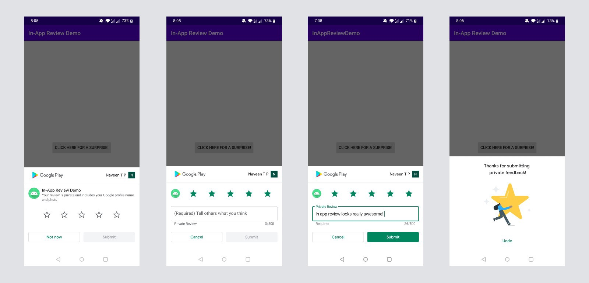

# In-App-Review-API-Demo
> Testing In-App Review API

Screenshots |
---|
 |

# Set-up
<b>To test the functionality:</b>    
Goto app module's `build.gradle` file and replace the applicationId `YOUR_PLAY_STORE_APP_ID` to your play store applicationId.  
  
# Watchouts
- Make sure you give applicationId of an app which is available in Play Store.
- If you have already given rating in the past, Rationg dialog will not show up. Sign-in with different account in play store and try again.
- Due to quota limitations, calling a `launchReviewFlow` method might not always display a dialog. It should not be linked with any button click event.
- While testing one of my apps, I had to create a signed apk to see the Review card but for the other app, debug build worked just fine.
